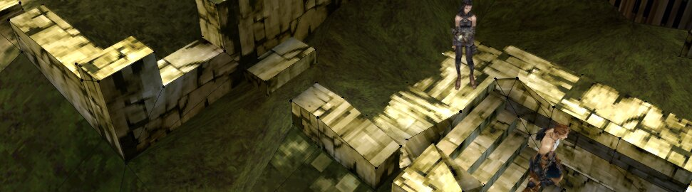
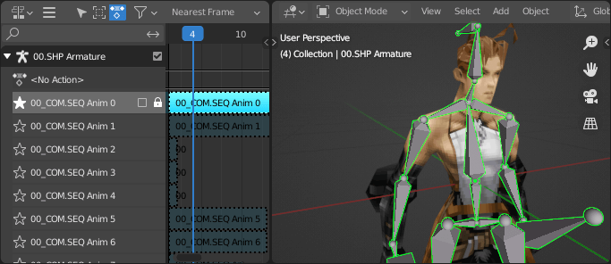

  

<h3 align=center>Vagrant Story Model Importer for Blender</h3>

Tested with Blender 2.93

 

Blender importer for
Vagrant Story .WEP, .SHP, .ZUD, and .MPD models.
I would rate compatibility as "fair".

To use, save
[import_vagrant_story.py](https://raw.githubusercontent.com/scurest/VagrantStoryImporter/master/import_vagrant_story.py)
to your computer,
[install it as a Blender addon](https://blender.stackexchange.com/a/1689),
and enable "Vagrant Story Model Importer".

Insert the Vagrant Story CD or mount the ISO,
and look for model files in the `OBJ/` and `MAP/` folders.
Open the importer with `File > Import > Vagrant Story`,
and pick the model you want to import.

Thanks goes to morris's
[Vagrant Story Tools](https://github.com/morris/vstools)
where I cribbed all the code from.
There's also another Blender addon
with import *and* export support:
https://github.com/korobetski/blender-vagrant-story.

 

#### WEP

WEPs are weapons.

#### MPD & ZND

MPDs are maps.
If you're looking for a specific map,
look it up in
[this table](https://datacrystal.romhacking.net/wiki/Vagrant_Story:rooms_list).

Textures are stored in a zone (.ZND) file.
The importer uses the above table
to automatically load the right zone file
for your MPD.
If it can't find a zone file,
the map will be untextured.

#### SHPs, ZUDs, & SEQs

SHPs are characters.
ZUDs are units
(basically a SHP + WEP + SEQ).

SEQ files contain animations.
When you load a SHP or ZUD model,
the importer automatically looks for SEQs
to load too.
To see your model's animations,
open the Nonlinear Animation Editor.
To change the animation that's playing,
click the star
next to the track you want to play.

#### Rest Pose

Model files don't contain a rest pose,
so the importer uses the first pose
from the first animation
as the rest pose.
If there are no animations,
the default rest pose will look,
uh... bad (you'll be able to tell).

If you don't like the rest pose,
you can change it to a different one
after importing.
With the armature in the pose you want,
make sure the armature is the active object,
and run this line from the Python Console:

    from import_vagrant_story import set_rest_pose; set_rest_pose(C)

